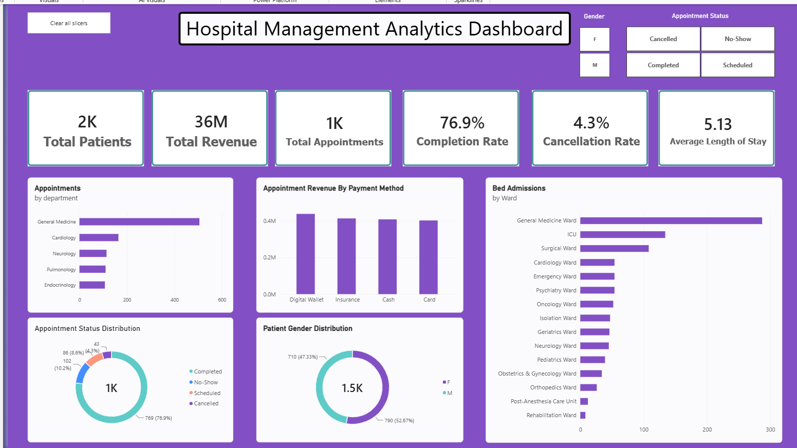

# Hospital Management Analytics

An end-to-end hospital analytics project using **MySQL, SQL, Power BI, and Excel** to analyze patient demographics, appointment performance, hospital admissions, staff/doctor data, length of stay, and revenue.

## 📊 Project Overview

This project analyzes hospital management data to generate actionable insights into:

- Patient demographics and age groups
- Appointment volume and performance
- Department-wise patient and appointment activity
- Doctor and hospital operations
- Bed admissions and ward activity
- Patient length of stay
- Revenue and payment methods
- Data quality and consistency

The project follows an end-to-end analytics workflow:

**Excel → MySQL → SQL Analysis → Power BI Dashboard → Business Insights**

---

## 🎯 Business Objectives

The main objectives of this project are to:

- Understand the overall patient population
- Analyze appointment completion and cancellation patterns
- Identify departments with the highest appointment volume
- Analyze hospital admissions across wards
- Measure average patient length of stay
- Understand revenue distribution across payment methods
- Identify data quality issues in the hospital records
- Build an interactive dashboard for management-level reporting

---

## 🗂️ Dataset

The dataset consists of multiple relational tables representing different aspects of hospital operations.

### Main Tables

| Table | Description |
|---|---|
| `patients` | Patient demographic information |
| `appointment` | Appointment details and payment information |
| `doctor` | Doctor information and department mapping |
| `department` | Hospital department information |
| `medicalrecord` | Patient medical records and visits |
| `bed` | Hospital bed information |
| `bedrecords` | Patient bed admission and discharge records |
| `ward` | Hospital ward information |
| `room` | Hospital room information |
| `roomrecords` | Room admission records |
| `nurse` | Nurse information |
| `helpers` | Hospital helper information |
| `staffshift` | Staff shift schedules |
| `surgeryrecord` | Surgery and procedure information |

---

## 🛠️ Tools & Technologies

- **MySQL** – Database creation, data management, and SQL analysis
- **SQL** – Data exploration, validation, aggregation, joins, and business analysis
- **Power BI** – Interactive dashboard and visualization
- **DAX** – KPI and analytical measures
- **Excel** – Source dataset and data preparation

---

## 🔍 SQL Analysis

The project contains **20 business-oriented SQL analyses** covering:

### Patient Analysis
- Total number of patients
- Gender distribution
- Patient age analysis
- Age-group distribution
- Patients with multiple medical records

### Appointment Analysis
- Total appointments
- Appointment completion rate
- Appointment cancellation rate
- Busiest calendar month
- Department-wise appointment volume
- Patient volume by department

### Hospital & Operational Analysis
- Bed admissions by ward
- Admissions per bed
- Number of beds by ward
- Average length of stay
- Ward-wise average length of stay

### Revenue Analysis
- Revenue generated by payment method

The SQL scripts are organized into separate files for easier understanding and reproducibility.

---

## 📈 Power BI Dashboard

### Hospital Management Analytics Dashboard

The Power BI dashboard provides an interactive overview of hospital performance.

### Key KPIs

- Total Patients
- Total Appointments
- Appointment Completion Rate
- Appointment Cancellation Rate
- Total Admission Revenue
- Average Length of Stay

### Dashboard Visualizations

- Appointments by Department
- Appointment Revenue by Payment Method
- Bed Admissions by Ward
- Appointment Status Distribution
- Patient Gender Distribution
- Interactive Gender filter
- Interactive Appointment Status filter
- Clear All Slicers functionality

### Dashboard Preview



---

## 💡 Key Insights

Based on the analysis:

- The dataset contains **1,500 patients** and **1,000 appointments**.
- **76.9%** of appointments were completed.
- The overall appointment cancellation rate was **4.3%**.
- **General Medicine** recorded the highest appointment volume.
- **General Medicine Ward** had the highest number of bed admissions.
- The average patient length of stay was approximately **5.13 days**.
- Female patients represented approximately **52.7%** of the patient population, while male patients represented approximately **47.3%**.
- Appointment revenue was distributed across Cash, Card, Insurance, and Digital Wallet payment methods.

---

## 🔎 Data Quality Analysis

Data validation was performed before analysis to identify potential inconsistencies.

One notable finding was that **74 medical records (2.47%)** contained a `next_Visit` date earlier than the corresponding `visit_Date`.

Instead of modifying the original records, the issue was documented as a data-quality finding.

---

## 📁 Project Structure

```text
Hospital-Management-SQL-Analytics/
│
├── README.md
│
├── sql/
│   ├── 01_database_setup.sql
│   ├── 02_data_exploration.sql
│   ├── 03_data_quality.sql
│   ├── 04_patient_analysis.sql
│   ├── 05_appointment_analysis.sql
│   ├── 06_doctor_analysis.sql
│   └── 07_hospital_analysis.sql
│
├── powerbi/
│   └── Hospital_Management_Analytics.pbix
│
└── dashboard/
    └── hospital_dashboard.png
